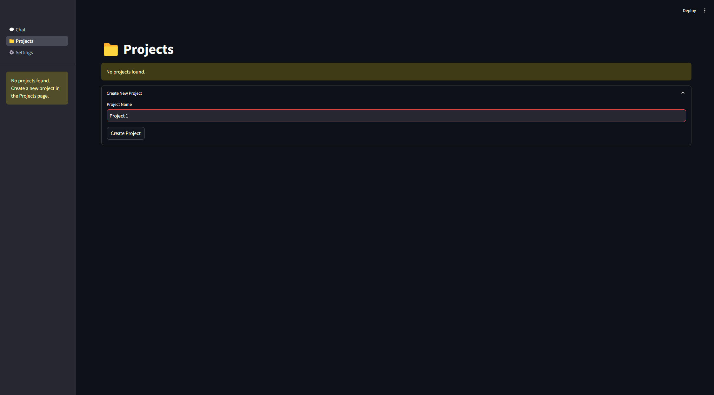
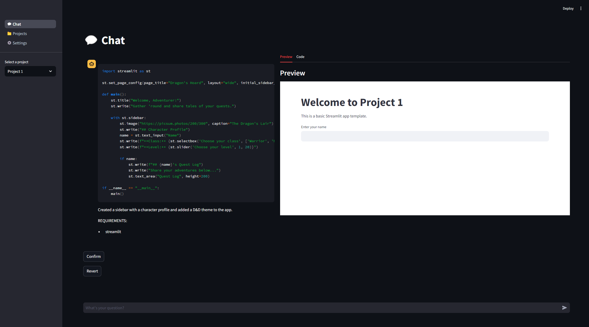
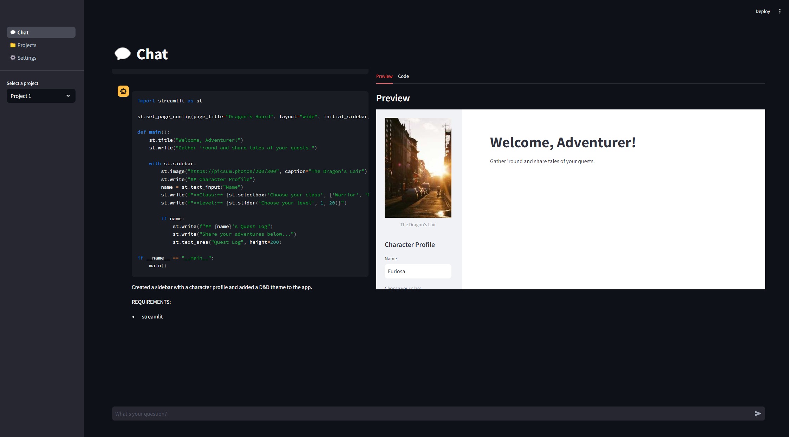

# Streamlit LLM Chat

Streamlit LLM Chat is a versatile chatbot application built using the Streamlit framework. This project allows users to interact with language models from various providers, manage API keys, and configure settings for a customized conversational experience.

<table>
  <tr>
    <td>
      
    </td>
    <td>
      
    </td>
  </tr>
    <tr>
    <td>
      
    </td>
  </tr>
</table>

## Connect with Me
| Contact Info       |                      |
|--------------------|----------------------|
| Joseph LePore  | [](https://www.linkedin.com/in/joseph-lepore-062561b3/)    |

## Features

- **Multiple LLM Providers**: Integrate with providers like Groq, OpenAI, Anthropic, Google, and Cohere.
- **Project Management**: Create, edit, and manage multiple projects with customizable settings.
- **Interactive UI**: Streamlit-based interface with features for chatting, viewing project code, and managing settings.
- **Code Editing**: Real-time editing of project files with an integrated text editor.
- **Environment Management**: Manage API keys and settings through `.env` and `settings.json` files.

## Installation

To set up the Streamlit LLM Chat, follow these steps:

1. **Clone the repository**:
    ```sh
    git clone https://github.com/leporejoseph/Groq-Artifacts-Streamlit.git
    cd streamlit-llm-chat
    ```

2. **Install the dependencies**:
    ```sh
    pip install -r requirements.txt
    ```

3. **Run the application**:
    ```sh
    streamlit run app.py
    ```

## Configuration

Configuration settings are managed through `.env` and `settings.json` files:

- **API Keys**: Store API keys for different LLM providers in the `.env` file.
- **Model Selection**: Choose the model and provider in `settings.json`.

### .env File

Ensure your `.env` file contains the necessary API keys for the LLM providers you intend to use. For example:
